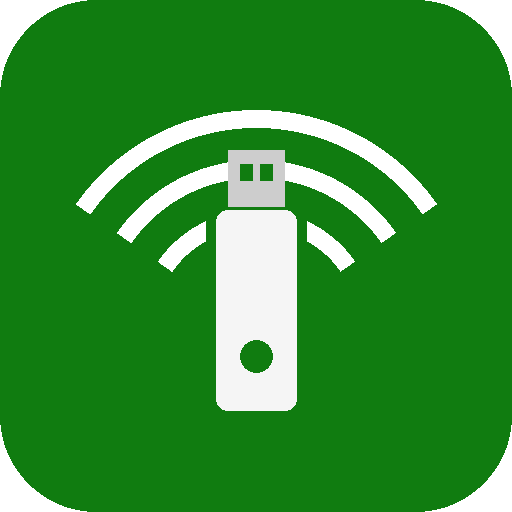

# Xbox Wireless Helper

[](https://github.com/m2aadhil/decky-xbox-wireless-helper/actions/workflows/build.yml)
[](https://github.com/m2aadhil/decky-xbox-wireless-helper/releases/latest)
[](LICENSE)

A [Decky Loader](https://github.com/SteamDeckHomebrew/decky-loader) plugin for Bazzite, SteamOS, and other Decky-compatible distros. It:

- **Fixes the Xbox Wireless Adapter after sleep.** On many Linux setups the adapter stops passing controller input after resume until you physically unplug and replug it. This plugin does that replug in software automatically.
- **Lets the controller wake the PC.** Press the Xbox button to resume from sleep.
- **Adds a pairing button** to the Quick Access menu, so you don't have to reach behind the PC to press the button on the adapter.



## Features

| | |
|---|---|
| Auto-reset on resume | Soft-replugs the adapter a few seconds after the system wakes |
| Reset adapter now | Manual soft-replug from the Quick Access menu |
| Wake PC with controller | Enables USB and firmware (ACPI) wake along the adapter's path and keeps it enabled across resets |
| Keep USB powered in sleep | Last resort: switches suspend from deep sleep (S3) to s2idle. ⚠️ Fans may keep running |
| Start / Stop pairing | Puts the adapter into pairing mode (needs the `xone` driver) |
| Delay after wake | 0–15 s, increase if the reset doesn't stick on your hardware |
| Notifications | Toast after every automatic reset |

Supported adapters (USB `045e:xxxx`): `02e6`, `02f9`, `02fe`, `091e`.

## How it works

- **Resume detection.** The backend compares `CLOCK_BOOTTIME` and `CLOCK_MONOTONIC`. The first keeps counting during suspend and the second doesn't, so a jump between them means the system slept. This works in Game Mode and Desktop Mode without hooking into systemd or Steam.
- **Soft replug, escalating.** Right after resume the adapter firmware can be too wedged to answer (`EPROTO`, errno 71). The plugin retries transient errors with backoff and escalates, each step closer to a physical replug:
  1. **re-authorize:** writes `0` and then `1` to `/sys/bus/usb/devices/<port>/authorized`. The driver unbinds and the adapter is re-probed.
  2. **port power-cycle:** toggles `disable` on the hub port. The adapter is disconnected and re-enumerated from scratch.
  3. **USB reset:** sends the `USBDEVFS_RESET` ioctl, which is what `usbreset` does.

  Before resetting, the plugin waits for USB enumeration to settle, because the kernel sometimes drops and re-enumerates the adapter on wake. It also looks the adapter up again before every step. A step only counts as successful once the driver has re-bound. The adapter is never left de-authorised.
- **Wake from sleep.** For a USB device to wake the PC, wake has to be allowed at every level: adapter → hub(s) → root hub → xHCI controller. The plugin enables `power/wakeup` on exactly that path, so neighbouring devices like a mouse aren't affected. It re-applies the setting whenever the adapter is re-enumerated, because the adapter comes back with wake disabled every time. It also enables the matching firmware entries in `/proc/acpi/wakeup` (for example `XHC0` for the controller and `GP17` for the PCIe bridge above it), which many AMD boards require. It records the original values and restores them when you turn the toggle off or uninstall.
  The `xone` driver itself arms *wake-on-wireless* on the adapter's radio when the PC goes to sleep, so the adapter can hear the Xbox button while suspended. That only works if the adapter keeps power and firmware through sleep. See [why the adapter is pickier than a keyboard](#4-optional-wake-the-pc-with-the-xbox-button).
- **Pairing.** It writes to the `pairing` attribute that the [xone](https://github.com/dlundqvist/xone) driver exposes on the adapter's USB interface.

The backend runs as root (`root` flag in `plugin.json`) because it writes to sysfs.

## Setup guide

### 1. Install the plugin

1. Download `decky-xbox-wireless-helper.zip` from the [latest release](https://github.com/m2aadhil/decky-xbox-wireless-helper/releases/latest).
2. In Decky, open **Settings → General** and enable **Developer mode**.
3. Go to **Settings → Developer → Install plugin from ZIP file** and pick the zip.

### 2. Plug in the adapter

After installing for the first time, plug the Xbox Wireless Adapter into a USB port so the plugin can detect it. If it was already plugged in, unplug it and plug it back in once. The adapter should then show up at the top of the plugin panel.

If it still shows **No adapter detected**, see [Troubleshooting](#no-adapter-detected).

### 3. Fix the controller after sleep

**Auto-reset on resume** is on by default. After every wake the plugin resets the adapter, so you no longer have to replug it. If the controller sometimes still doesn't respond after wake, raise **Delay after wake** to 5–8 s.

### 4. Optional: wake the PC with the Xbox button

1. Turn on **Wake PC with controller**. Every link listed under it should show *Wake allowed*.
2. **Configure the BIOS/UEFI.** :
   - Enable **Wake from USB** / **USB wake support** (the name varies by board).
   - Set **ErP Ready** to **Enabled (S4+S5)**. *Don't* use **Disabled** and *don't* use the S3 option.
   - If your board has **Deep Sleep** (common on ASUS and Gigabyte), disable it.
   - On some boards you also need **Power on by PCI-E** or similar, because the USB controller is a PCIe device.
3. Sleep the PC and press the Xbox button.

### 5. Last resort: Keep USB powered in sleep

If no BIOS setting works, turn on **Keep USB powered in sleep**. It switches suspend from deep sleep (S3) to *s2idle*, which keeps the USB ports fully powered, so the Xbox button will wake the PC.

> ⚠️ **Fans may keep running.** s2idle isn't a real power-off sleep: the board stays in its "on" power state. Laptops and handhelds are designed for this, but most desktop motherboards keep the fans spinning and use noticeably more power while "asleep". Try the BIOS settings above first, and use this only if nothing else works.

## Troubleshooting

### The Xbox button doesn't wake the PC

Work through [step 4 of the setup guide](#4-optional-wake-the-pc-with-the-xbox-button) first. The BIOS is the most common cause. Then check:

- Under **Wake from sleep**, every link should show *Wake allowed*.
- The panel shouldn't warn about the driver. Wake needs `xone`, because `xpad` and other drivers don't support wake-on-wireless.
- Bluetooth controllers can't wake the PC on Linux. Use the adapter or a cable.

If the PC wakes up but the controller doesn't respond, that's what auto-reset is for. Leave it on.

### No adapter detected

- **Just installed the plugin?** Unplug the adapter and plug it back in once (see [step 2](#2-plug-in-the-adapter)).
- **Adapter reconnecting…** is normal for a few seconds after wake or during a reset.
- If it says your controller is connected **over Bluetooth**, the controller is working, but not through the adapter. Re-pair it with the adapter by pressing the pair buttons on both.
- If it lists an unrecognised Microsoft USB ID, please open an issue with that ID.

### Other issues

- Logs are in `~/homebrew/logs/Xbox Wireless Helper/`. A successful wake shows `Resume detected`, then `USB settled`, then `reset OK via …`.
- If the controller still doesn't respond after wake, raise **Delay after wake** to 5–8 s.
- The log shows which reset strategy worked, for example `reset OK via port-cycle`. If all three fail, open an issue and include the log.
- If the **Pairing** button is disabled, the adapter isn't bound to `xone`. Check with `lsusb -t`.
- If you previously added a `systemd/system-sleep` hook for this, remove it so the adapter isn't reset twice.

## Development

The layout follows the official [decky-plugin-template](https://github.com/SteamDeckHomebrew/decky-plugin-template).

```
main.py                    # Decky backend entry point (Plugin class)
py_modules/xbox_wireless/  # sysfs + suspend logic, no Decky dependency (unit-tested)
src/index.tsx              # Quick Access panel (React, @decky/ui)
tests/                     # Python unit tests against a fake sysfs tree
decky.pyi                  # typings for the `decky` module (from the template)
.vscode/                   # template tasks: setup, build (Decky CLI), deploy to device
```

Requirements: Node.js 18+, pnpm 9, and Python 3.11.

```bash
pnpm install
pnpm typecheck
pnpm test          # Python unit tests
pnpm package       # → out/decky-xbox-wireless-helper.zip
```

To deploy straight to a handheld or PC, use the VS Code tasks. Run `setup` once, then `builddeploy`, after filling in `.vscode/settings.json` with the device's IP and user.

### Releasing

The **Build** workflow runs on every push and pull request: type-check, unit tests, build, and the zip uploaded as an artifact.
The **Release** workflow runs on `v*` tags and attaches the zip to a GitHub Release.

```bash
npm version patch          # bumps package.json and tags vX.Y.Z
git push --follow-tags
```

## License

BSD-3-Clause. See [LICENSE](LICENSE).
